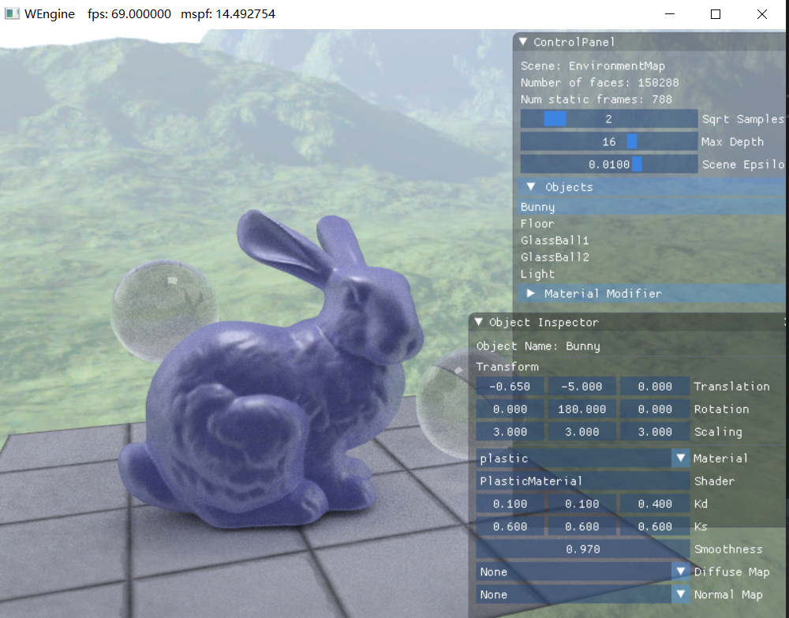
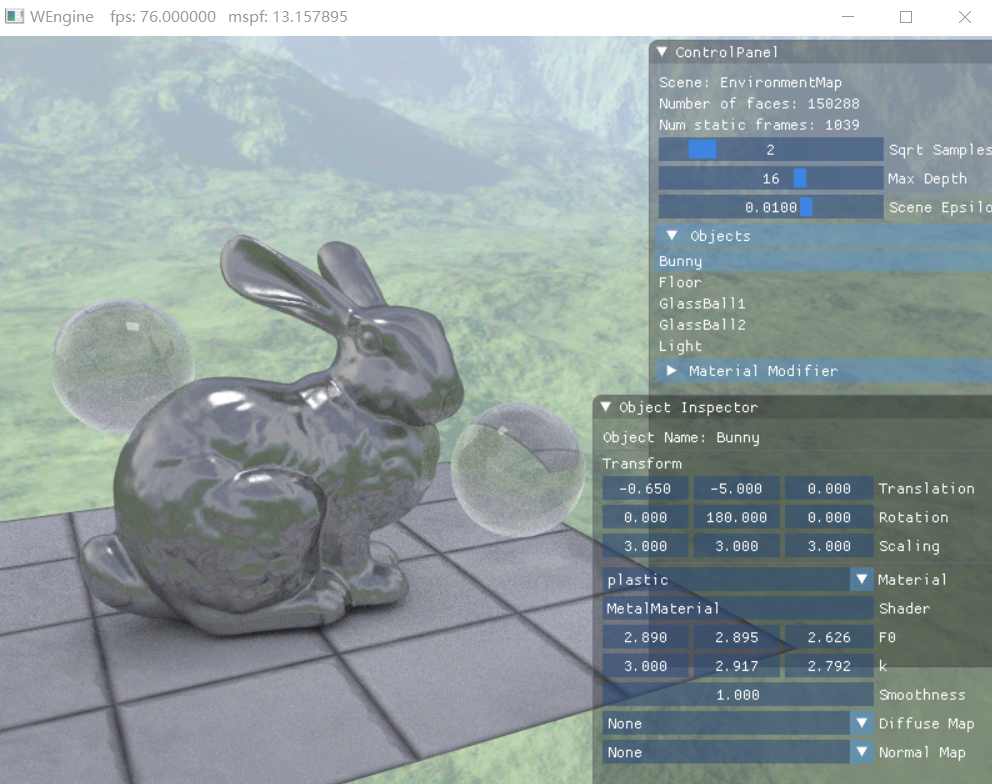

# WEngine
WEngine是一个基于DirectX Raytracing API实现的路径追踪渲染器。在RTX硬件光追加持下，渲染具有15万面的场景时，仍能够达到50fps以上的帧率。
渲染器内嵌ImGUI库实现了基本的用户交互界面，支持对模型变换矩阵和材质参数的动态修改。

渲染器能够解析XML格式的场景描述文件，支持对obj格式的模型的加载，支持纹理贴图、切线空间法线贴图。参照pbrt实现玻璃、镜面、黏土、金属、塑料等材质。
- 塑料材质

- 金属材质（铁）

